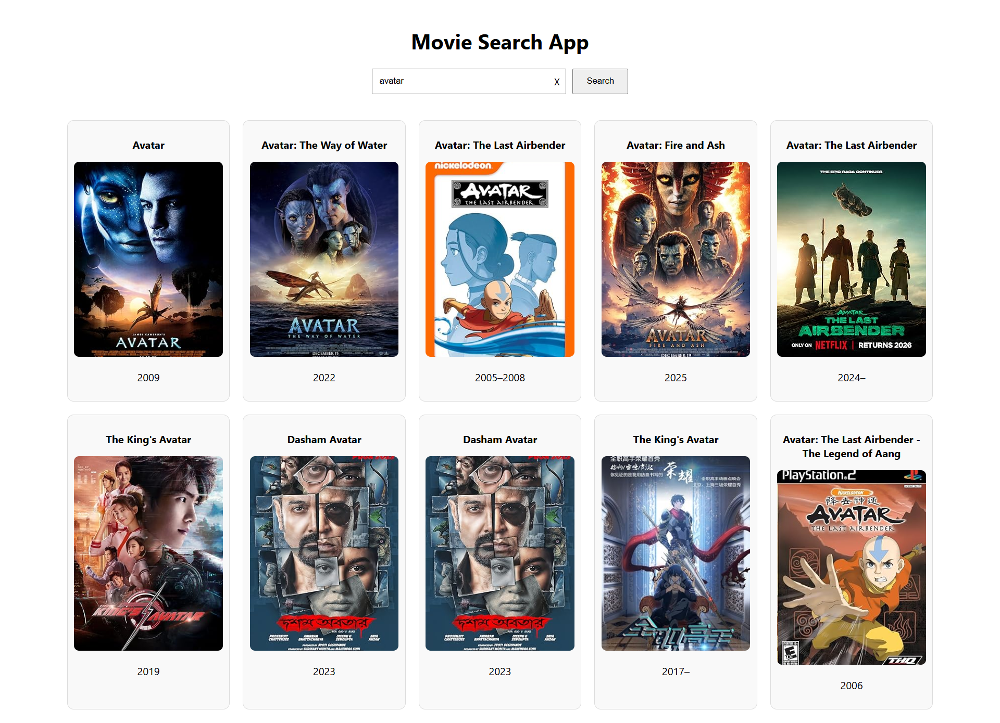

#  Movie Search App

A responsive React application that lets users search for movies in real time using the OMDb REST API — built with clean component architecture, debounced search, and production-quality error handling.

🔗 **[Live Demo](https://merinjohnv.github.io/movie-search-react)**  &nbsp;|&nbsp; 💻 **[GitHub Repo](https://github.com/Merinjohnv/movie-search-react)**

---

##  Features

-  **Debounced search** — auto-searches 500ms after you stop typing, reducing unnecessary API calls
-  **Keyboard support** — press Enter to search instantly
-  **Clear button** — one-click reset of search and results
-  **Error handling** — catches network failures and API errors with user-friendly messages
-  **Fallback images** — gracefully handles missing or broken posters with a placeholder
-  **Fully responsive** — tested at 320px, 480px, 768px, and 1200px+
-  **Accessible** — ARIA labels, roles, and alert regions for screen readers
-  **CSS variables** — easy theming with a clean dark UI
-  **Secure API key** — stored in `.env`, not hardcoded in source

---

##  Tech Stack

| Technology | Usage |
|---|---|
| React 18 | Component architecture, hooks (useState, useEffect, useCallback) |
| JavaScript ES6+ | Async/await, destructuring, closures, custom debounce |
| CSS3 | Grid, Flexbox, CSS variables, transitions, media queries |
| OMDb REST API | Real-time movie data fetching |
| Fetch API | Async data fetching with error handling |
| Git / GitHub | Version control and deployment |

---

##  Project Structure

```
src/
├── App.js          # Main component — search logic, debouncing, state management
├── App.css         # Global styles, CSS variables, responsive breakpoints
├── MovieCard.jsx   # Reusable movie card component
└── MovieCard.css   # Card styles, hover animations, aspect ratio layout
```

---

##  Getting Started

```bash
# 1. Clone the repository
git clone https://github.com/Merinjohnv/movie-search-react.git
cd movie-search-react

# 2. Install dependencies
npm install

# 3. Set up environment variable
cp .env.example .env
# Add your OMDb API key → REACT_APP_OMDB_API_KEY=your_key_here
# Get a free key at https://www.omdbapi.com/apikey.aspx

# 4. Start development server
npm start
```

---

##  Key Implementation Details

**Custom Debounce (no lodash)**
```js
function debounce(fn, delay) {
  let timer;
  return (...args) => {
    clearTimeout(timer);
    timer = setTimeout(() => fn(...args), delay);
  };
}
```
Written from scratch to demonstrate understanding of closures and JavaScript timers — not just library usage.

**Error Handling**
```js
try {
  const response = await fetch(`...`);
  if (!response.ok) throw new Error("Network error.");
  const data = await response.json();
  if (data.Error) throw new Error(data.Error); // OMDb returns 200 even on errors
  setMovies(data.Search || []);
} catch (err) {
  setError(err.message);
} finally {
  setLoading(false); // always runs
}
```

**Fallback Image (double safety)**
```jsx
 { e.target.src = FALLBACK_IMAGE; }}
  alt={movie.Title}
/>
```

---

##  Screenshot




---

*Built by [Merin John](https://www.linkedin.com/in/merinjohnv) · [GitHub](https://github.com/Merinjohnv)*